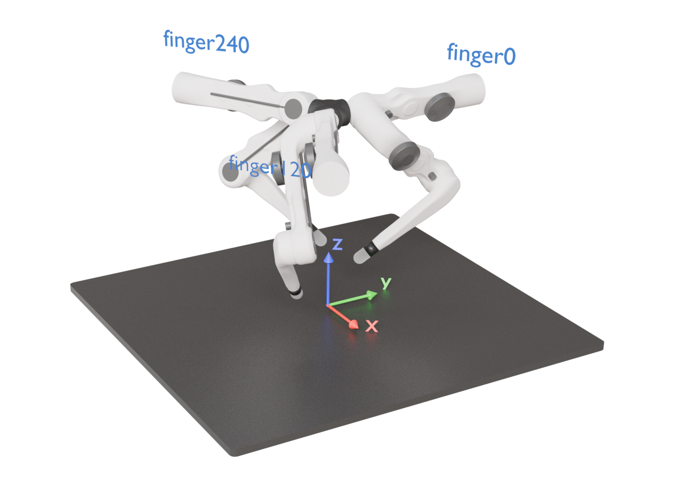
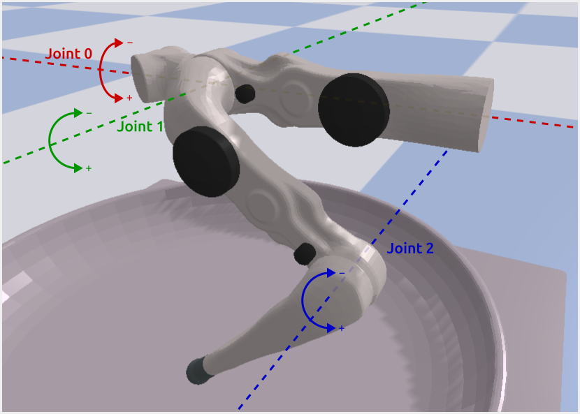
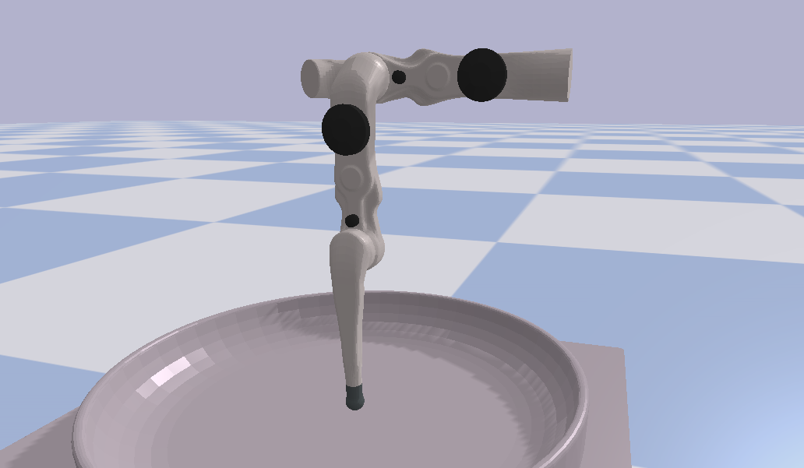

*******************************
Coordinate Frame and Joint Axes
*******************************

Reference Frame
===============

The reference frame of the robot is in the center between the fingers on the ground.
The first finger ("finger0") is aligned with the y-axis, the other two are rotated by 120° and 240° around the z-axes:

Joint Axes
==========

For "FingerPro" and "FingerEdu" fingers, directions of rotation (i.e. which direction is
positive and which is negative) is as depicted in the image above.

**For "FingerOne", joint 1 is inverted,** the others are the same.

Zero Position
=============

All joints are in zero-position when the finger is pointing straight down:

