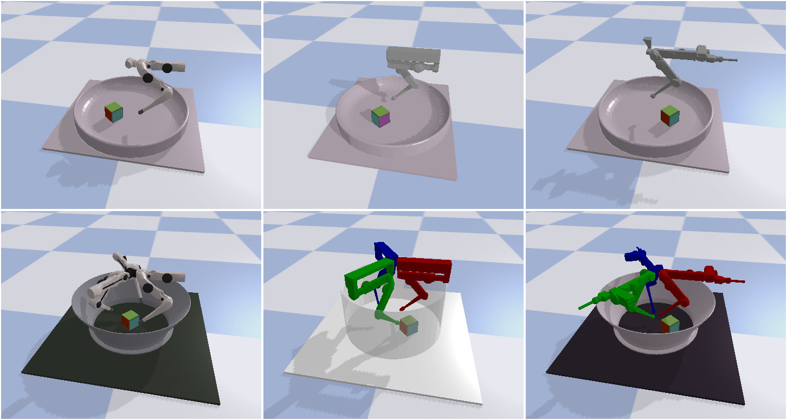

``robot_properties_fingers`` contains the URDF model files for the various
:doc:`(Tri-)Finger robots <trifinger_docs:index>` as well as some Python utils
to work with them.

The source code is hosted on GitHub_.  Please also use the `Bug Tracker`_ there
if you have a question or want to report a bug.

Last rebuild of this documentation: |today|

.. toctree::
   :caption: General Documentation
   :maxdepth: 1

   doc/installation.rst
   doc/models.rst

.. _GitHub: https://github.com/open-dynamic-robot-initiative/robot_properties_fingers
.. _Bug Tracker: https://github.com/open-dynamic-robot-initiative/robot_properties_fingers/issues
